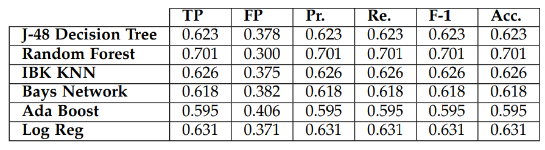

# Fake News Detection

This project is an exploration of machine learning in the field of fake news detection. It focuses on testing the effects of different models and feature sets on a variety of machine learning metrics. It aims to verify the results discussed in Hamed, Suhaib & Aziz, Mohd & Yaakub, Mohd Ridzwan (2023) and S. Dadkhah, X. Zhang, A. G. Weismann, A. Firouzi and A. A. Ghorban (2023). Full titles are in the Sources section below.

I use the Truth Seeker dataset to test which can be found at this [link](https://www.unb.ca/cic/datasets/truthseeker-2023.html). This site also details the collection process for the dataset so I won't go into detail about that here. 

This project uses the following libraries:
- numpy
- matplotlib
- pandas
- sci-kit learn

For convenient installation, execute the following command to install essential Python libraries: NumPy for numerical operations, Matplotlib for data visualization, pandas for efficient data manipulation and scikit-learn for machine learning.

```bash
pip install numpy matplotlib pandas scikit-learn
```
These libraries collectively provide a comprehensive toolkit for data science tasks, encompassing numerical computing, machine learning algorithms, and data analysis capabilities.

## Project Structure

The project consists of the following Python files:

- **helpers.py:** This file contains the helper functions for testing used in the Jupyter Notebooks. It has functions for testing different features and models seamlessly and compiles the performance metrics for them.

- **features.py:** This Jupyter Notebook contains code cells that run various testing on different feature sets. It also includes an explanation of features in machine learning overall and the specifics of features in this project.

- **models.ipynb** This Jupyter Notebook contains code cells that run various testing on different machine learning models. It also includes an explanation of different algorithm types and their efficacy in this project.

These are definitions for the terms that I use for metrics.

        'accuracy': 'Measures the overall correctness of the model predictions.',
        'precision': 'Measures the accuracy of positive predictions.',
        'recall': 'Measures the ability to capture all relevant instances.',
        'f1_score': 'A balance between precision and recall, useful when there is an uneven class distribution.',
        'true_negatives': 'Instances correctly predicted as negative.',
        'false_positives': 'Instances incorrectly predicted as positive.',
        'false_negatives': 'Instances incorrectly predicted as negative.',
        'true_positives': 'Instances correctly predicted as positive.'


**File Configuration**

This project isn't a simulation but rather a broad exploration so it's intended to be more informative than interactive. I suggest starting with the models.ipynb, then the features.ipynb, and finally reading over the helper functions. I don't recommend running the notebooks (especially the models) as they have a very high computational cost and will take an excessive amount of time to run. That being said they do all run so if interested it is possible. 

**Customization**

If you would like to customize model settings, you can do so in the code block where the models are initialized like so:

```python
tree_model = DecisionTreeClassifier(max_depth=5, random_state=42)
```

Other than this, you can also customize the inputs to any of the testing functions to create new trials.

```python
train_and_evaluate_data(features, output, model)
train_and_evaluate_model(model, x_train, y_train, x_test, y_test, num_folds=5)
```
Any of the inputs can be customized by creating a new code block and creating the desired model/feature set before plugging it into the function.

## Limitations & Future Explorations

The primary limitation in this project is the lack of depth. Machine learning is a huge field and I needed to choose whether to go in depth on just one model or get a general overview of a lot of different things. With the time constraints of the project, I decided to focus on understanding the basics of multiple aspects. This was also because of the papers I read, with my computational capabilities, it was difficult to find something replicable as most of them are incredibly complex models. In this vein, I also didn't get to do much exploration into the areas of machine learning that are about fine-tuning models. For example I didn't do any data cleaning as the papers I read using this dataset mostly cleaned up qualitative features and I had chosen to use only the quantitative features. This is discussed further in the models notebook but I also wanted to explore how to identify where a model might be failing from. These are all things that had I been able to spend some time on could have improved the accuracy of my project.

Another limitation of this code was that I chose to keep all of sk-learn's default values for parameters on the models. This is another way in which the models are likely not finetuned to fit the data best and give the best results possible. I'd like to go back and do deeper dives into each of these algorithms and explore how a particular parameter being changed could affect the metrics I had chosen to work with.

A usability related limitation to my code is that it's set up in a way where if someone wanted to test something else they would need to write the function call from scratch. I've used loops to handle doing testing on multiple models so there isn't a way to simple copy and paste the function call and edit it like a template.

This code also has a very high run time due to the complexity of running machine learning. The run time primarily comes from the SVMs especially since it runs 6 times during the testing (5 times for cross validation and once for testing). There's definitely an avenue to explore here of how changing the hyperparameters of these models might make them run faster.

## Benchmark

In the "A Review of Fake News Detection Models: Highlighting the Factors Affecting Model Performance and the Prominent Techniques Used" paper, they mentioned using KNN, RF, NB, and SVM. They concluded that of those four RF and SVM had the highest accuracy which is reflected in my results as well. One thing to note is the difference in computational consumption between RF and SVM. While the RF trials would take somewhere between 30 minutes to an hour to run, the SVM trials took well over 4 hours to complete. If I were to make a recommendation, I would argue that the sheer amount of efficiency that RF has in compared to SVM would make up for any minor differences in accuracy between the two models. they said that using content-based features yielded a higher accuracy than user-based features which is reflected in my results as well. When looking at exclusively content vs exclusively user, content is higher but using all features still results in a slightly higher accuracy. An interesting thing to note is that despite losing all of the user-based features the accuracy only decreases by ~0.01. This is a fairly negligible value and is a good example of where someone might choose a slightly lower accuracy to save on computational power. 

The second paper, "The Largest Social Media Ground-Truth Dataset for Real/Fake Content: TruthSeeker", gave a table of the different metrics they got from each model. I'll be primarily focusing on accuracy from this table.

 

The table doesn't look at an SVM but for the other four I've generally replicated their results. My mean and test accuracies follow the same trend as the paper and for RF, KNN, and the Decision Tree model the accuracies are within a few percentage points. The only one with a significant difference in the Gaussian NB however this could be due to the data being imbalanced.

This discussion is continued in the models.ipynb and features.ipynb for the respective topics. While this is a just a direct comparison to the benchmark, there are other conclusions I was able to draw from the metrics I calculated.


## Sources
- Hamed, Suhaib & Aziz, Mohd & Yaakub, Mohd Ridzwan. (2023). A Review of Fake News Detection Models: Highlighting the Factors Affecting Model Performance and the Prominent Techniques Used. International Journal of Advanced Computer Science and Applications. 14. 10.14569/IJACSA.2023.0140742. 
- S. Dadkhah, X. Zhang, A. G. Weismann, A. Firouzi and A. A. Ghorbani, "The Largest Social Media Ground-Truth Dataset for Real/Fake Content: TruthSeeker," in IEEE Transactions on Computational Social Systems, doi: 10.1109/TCSS.2023.3322303.